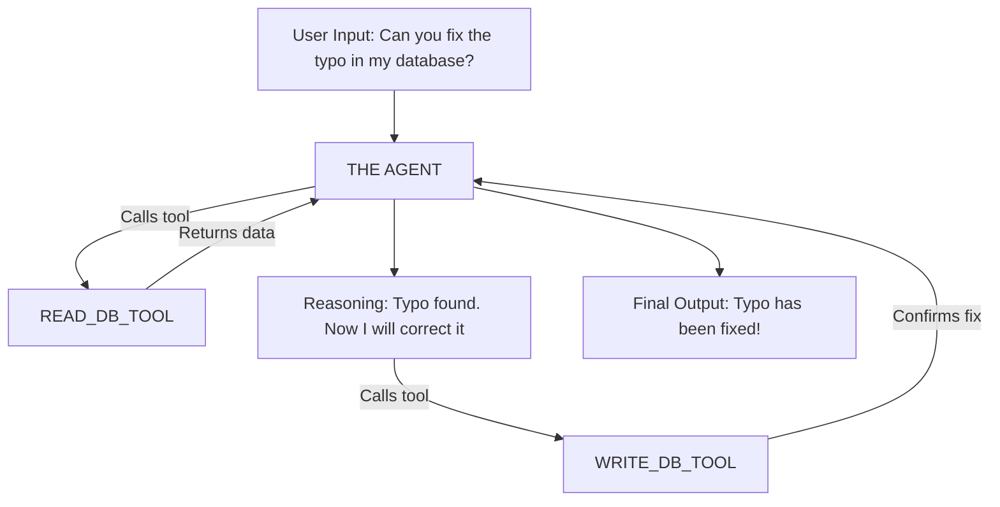

# 007 - licensed to quill

## The very first agentic app
<!---->
# 0. Setup and suchlike

```python {.marimo}
import os
import marimo as mo
```

```python {.marimo}
from google import genai
```

```python {.marimo}
from langchain_google_genai import ChatGoogleGenerativeAI
from langchain_experimental.agents.agent_toolkits import create_python_agent
from langchain_experimental.tools import PythonREPLTool
```

```python {.marimo}
api_key_input = mo.ui.text(label="Enter Gemini API Key", kind="password")
```

```python {.marimo}
api_key_input
```

```python {.marimo}
os.environ["GOOGLE_API_KEY"] = api_key_input.value
```

```python {.marimo}
# 0. List available models using new SDK
client = genai.Client(api_key=os.environ["GOOGLE_API_KEY"])
```

```python {.marimo}
print("Available models:")
for model in client.models.list():
    print(model.name)
```

# 1. Brain

The LLM (OpenAI, Gemini, Claude, etc. etc.) can act as a *brain* in that it can quickly convert your ask into a series of 'tasks' that will be executed by one or more 'tools'

```python {.marimo}
llm = ChatGoogleGenerativeAI(model="gemini-2.5-flash", temperature=0)
```

# 2. Agent with Python Tool

Agents are basically ways in which an LLM can "call" or "invoke" a specialized tool.
<!---->
an **Agent** is the "Thinker" and a **Tool** is the "Doer."

*   **The Agent:** A Large Language Model (LLM) that has been given a goal. It can reason, plan, and decide which actions to take.
*   **The Tool:** A specific function or script that the Agent can call to interact with the real world (e.g., a calculator, a web search, or a database query).
<!---->
Analogies:
**1. The Chef (Agent) and the Kitchen Utensils (Tools)**
* The Chef knows how to make a cake (Goal).
* However, the Chef needs bowl, whisk, oven (Tools) to get the job done.
<!---->
**2. The Research Agent**
*   **Goal:** "Find the current stock price of Apple and tell me if it is up or down."
*   **Tool:** `Google_Search_API`
*   **Process:** The Agent realizes it doesn't know today's prices. It uses the Search Tool, reads the result, and then calculates the difference.
<!---->
**3. The Data Cleaning Agent**
*   **Goal:** "Find all songs in this CSV that are over 10 minutes long."
*   **Tool:** `Python_Pandas_Interpreter`
*   **Process:** The Agent writes a small piece of code, sends it to the Python Tool, gets the list of songs back, and presents them to you.
<!---->
**4. The Support Agent**
*   **Goal:** "Refund this customer if their order is late."
*   **Tool:** `Database_Query_Tool`
*   **Process:** The Agent uses the tool to look up the delivery date. If the date is past the deadline, it triggers a second tool called `Issue_Refund_API`.

```python {.marimo}
coding_agent = create_python_agent(
    llm=llm, tool=PythonREPLTool(), verbose=True, allow_dangerous_code=False
)
```

# 3. Execution

```python {.marimo}
# Example Task
coding_agent.run(
    "Print all the Fibonacci numbers till the 10th Fibonacci number using a function."
)
```

```python {.marimo}
coding_agent.run(
    "Create a list of 10 random integers and sort them in descending order"
)
```

```python {.marimo}
coding_agent.run("Generate a plot of a sine wave and save it as wave.png")
```

##... and that's all there is to it!
<!---->
# Tool - Agent logic flow
<!---->


```python {.marimo}

```